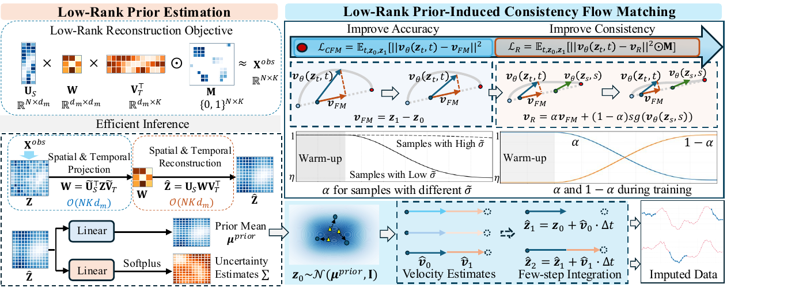
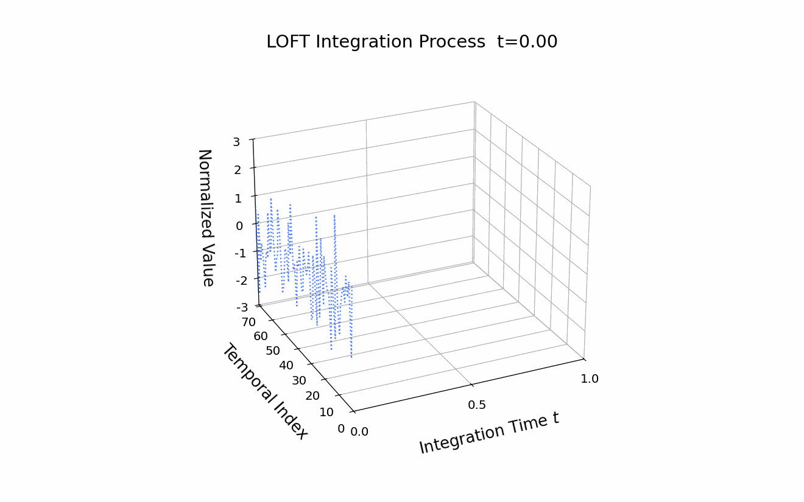
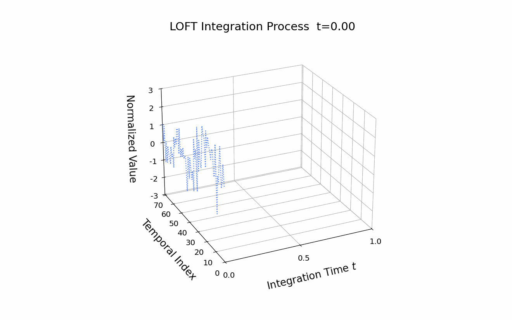
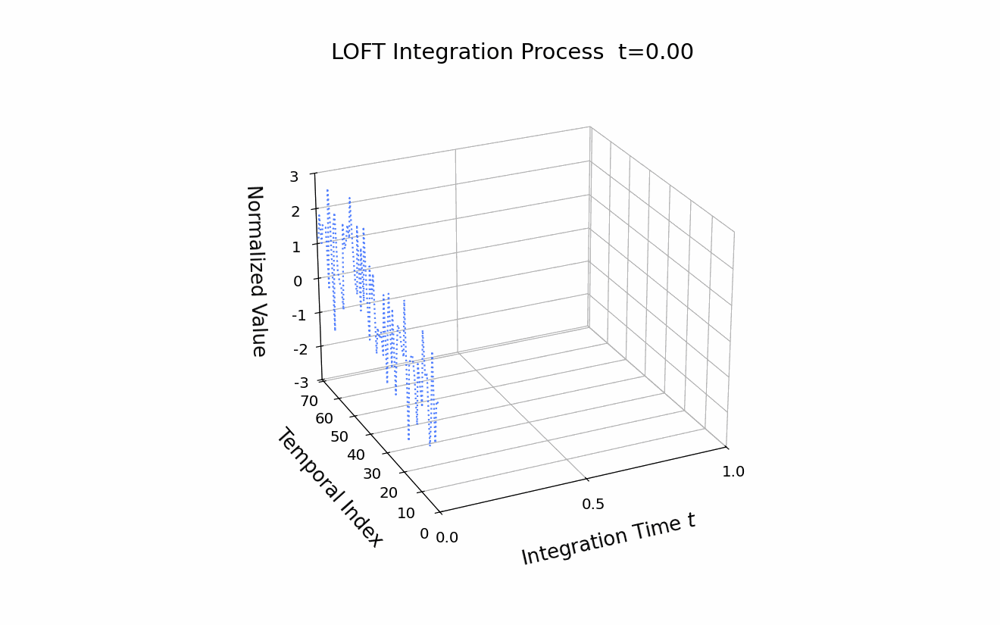
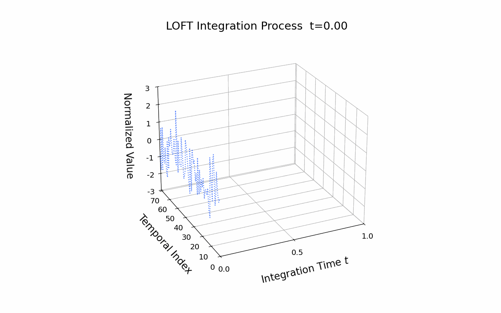

# Low-Rank Prior-Induced Consistency Flow Matching for Efficient Traffic Imputation

This repository provides the official implementation of **Low-Rank Prior-Induced Consistency Flow Matching for Efficient Traffic Imputation (LOFT)**.

LOFT targets accurate and efficient **probabilistic traffic imputation under highly sparse observations**. The key idea is to avoid learning the full transport from a non-informative Gaussian prior and to reduce the numerical integration cost of flow matching. LOFT first constructs an informative low-rank prior from sparse traffic measurements, then learns a prior-induced flow while progressively rectifying its generative trajectories toward near-linear paths for accurate few-step inference.

**Paper:** [https://dl.acm.org/doi/10.1145/3770855.3818063](https://dl.acm.org/doi/10.1145/3770855.3818063)

## Method

<p align="center"></p>

<p align="center"><em>Architecture of LOFT. An informative low-rank prior initializes the flow matching process, while uncertainty-aware rectification promotes consistent, near-linear trajectories for efficient few-step integration.</em></p>

LOFT addresses two main sources of inefficiency in generative traffic imputation: standard flow matching starts from a non-informative Gaussian prior and therefore learns an unnecessarily long transformation from noise to data, while the learned marginal vector field can still induce curved trajectories that require many ODE integration steps at inference time.

The method follows the formulation in the paper:

1. **Efficient Low-Rank Prior Estimation.** LOFT formulates prior construction as a masked low-rank factorization problem to recover inherent spatiotemporal correlations from sparse observations. The neural parameterization implements the spatial and temporal projections with linear complexity in the spatial and temporal dimensions. From the reconstructed feature, the estimator outputs the prior mean `prior_mean` and an element-wise uncertainty estimate `prior_uncertainty`; the uncertainty is supervised on valid observations using the Mean Interval Score (MIS).
2. **Low-Rank Prior-Induced Flow Matching.** Instead of the standard source distribution `N(0, I)`, LOFT initializes the conditional flow from `N(mu_prior, I)`, where `mu_prior` is produced by the low-rank estimator. This informative initialization narrows the transport distance to the data distribution while retaining unit variance to preserve stochasticity and distribution modeling capacity.
3. **Consistency Trajectory Flow Matching with Uncertainty-Aware Rectification.** Standard conditional flow matching supervises local velocity estimates but does not guarantee a globally consistent trajectory, so inference trajectories can remain curved. LOFT introduces a rectified velocity target that interpolates between the exact flow-matching target and a stop-gradient consistency target. The interpolation coefficient is scheduled jointly by training progress and sample uncertainty: early training and highly uncertain samples prioritize data fidelity, whereas later training and lower-uncertainty samples receive a stronger consistency constraint. This design mitigates the gradient conflict between accurate distribution fitting and trajectory linearization, enabling accurate few-step integration.

The paper evaluates LOFT on **PEMS03, PEMS04, and PEMS08** using chronological **60%/20%/20%** train/validation/test splits. The main experiments use the **SR-TC** and **SC-TC** missing patterns at an **80% missing rate**, with an additional **SC-TC 90%** high-sparsity study on PEMS04. Generative baselines use substantially larger inference budgets, while LOFT is configured with **10 NFE during training and 2 NFE during inference** in the main setting.

## Qualitative Examples

The following animations visualize the LOFT integration process from the informative low-rank prior toward the imputed traffic sample.

<table>
  <tr>
    <td width="50%" align="center"><strong>Case 1</strong><br></td>
    <td width="50%" align="center"><strong>Case 2</strong><br></td>
  </tr>
  <tr>
    <td width="50%" align="center"><strong>Case 3</strong><br></td>
    <td width="50%" align="center"><strong>Case 4</strong><br></td>
  </tr>
</table>

## Repository Structure

```text
LOFT_clean/
├── GenerateData/
│   ├── configurations/                 # Dataset paths for missing-data generation
│   └── generator.py                    # SR/SC and TR/TC missing-pattern generation
├── assets/
│   └── loft_architecture.png           # LOFT architecture from the paper
├── case/                               # Qualitative integration animations
├── config/
│   └── PEMS04.conf                     # LOFT configuration for PEMS04
├── prior/
│   ├── models.py                       # Efficient low-rank prior estimator
│   └── run_low_rank_prior_estimation.py
├── visualization/
│   ├── LOFT_plt_2steps_case.py         # Static few-step trajectory visualization
│   └── LOFT_plt_integration_gif.py     # Integration-process animations
├── dataset_traffic.py                  # Data loading and chronological splits
├── main_model.py                       # LOFT velocity network and flow objectives
├── run.py                              # Training and evaluation entry point
├── utils.py                            # Training, evaluation, and metrics
└── requirements.txt
```

## Environment

```bash
python -m venv .venv
source .venv/bin/activate
pip install -r requirements.txt
```

When using a GPU, install a PyTorch build compatible with the local CUDA runtime. A CPU smoke test can be run with `--device cpu`.

## Data Preparation

The code expects a raw PEMS archive containing the `data` array and its corresponding distance file. Before generating missing-data samples, update the dataset paths in `GenerateData/configurations/PEMS*.conf` and make sure the configured output directory exists.

For the PEMS04 SC-TC setting with an 80% missing rate:

```bash
python GenerateData/generator.py \
  --config GenerateData/configurations/PEMS04.conf \
  --misstype SC-TC \
  --missrate 0.8 \
  --patch 16
```

The generator writes the paired archives:

```text
true_data_SC-TC_0.8_v2.npz
miss_data_SC-TC_0.8_v2.npz
```

The generator supports `SR-TR`, `SC-TR`, `SR-TC`, and `SC-TC`. The main experiments in the paper report `SR-TC` and `SC-TC`.

## Low-Rank Prior Estimation

Train the low-rank estimator and generate the prior mean and uncertainty used by LOFT:

```bash
python prior/run_low_rank_prior_estimation.py \
  --true-path data/miss_data/PEMS04/true_data_SC-TC_0.8_v2.npz \
  --miss-path data/miss_data/PEMS04/miss_data_SC-TC_0.8_v2.npz \
  --dataset-name PEMS04 \
  --missing-type SC-TC \
  --missing-rate 0.8 \
  --pre-impute-dir data/pre_impute \
  --mode both \
  --device cuda:0
```

The generated `prior_*.npz` file contains:

- `prior_mean`: the low-rank prior mean used to initialize flow matching;
- `prior_uncertainty`: the element-wise uncertainty used by the uncertainty-aware rectification schedule;
- `imputed_data` and `sigma`: compatibility aliases for the two arrays above.

## Training LOFT

Set `data_prefix` and `low_rank_prior_dir` in `config/PEMS04.conf`, or override the generated prior file directly from the command line:

```bash
python run.py \
  --config config/PEMS04.conf \
  --mode train \
  --device cuda:0 \
  --low_rank_prior_path data/pre_impute/prior_PEMS04_SC-TC_0.8_TIMESTAMP.npz
```

The provided PEMS04 configuration follows the paper's main few-step setting. The key flow-matching parameters are:

```ini
[flow_matching]
num_steps = 10
inference_steps = 2
min_alpha = 0.2
```

The training schedule first performs a flow-matching warm-up and then activates the uncertainty-aware rectification stage. For PEMS03 or PEMS08, create a dataset-specific configuration using the same schema as `config/PEMS04.conf` and update the dataset paths and runtime device.

## Evaluation

Evaluation requires a trained LOFT checkpoint and the corresponding low-rank prior file:

```bash
python run.py \
  --config config/PEMS04.conf \
  --mode eval \
  --device cuda:0 \
  --cond_path params/LOFT_CHECKPOINT_cond.pth \
  --low_rank_prior_path data/pre_impute/prior_PEMS04_SC-TC_0.8_TIMESTAMP.npz
```

Training and evaluation write artifacts under the directory specified by `--output_root`:

- `params/*_cond.pth`: trained velocity-network checkpoints;
- `results/results_*.csv`: aggregate evaluation metrics;
- `results/evaluation_tensors_*.pth`: generated samples, targets, masks, and time indices used by the visualization scripts.

Run logs are written to `logs/main/` by default; use `--logfile` to select a different path.

## Trajectory Visualization

To save intermediate inference states during evaluation, add the following options to `run.py`:

```bash
--trace_file traces/inference_trace.pth --trace_batches 0 --trace_samples 1
```

`--trace_batches 0` records all evaluation batches. The saved trace and evaluation tensor can then be rendered as a static trajectory figure or an integration GIF:

```bash
python visualization/LOFT_plt_2steps_case.py \
  --trace-file traces/inference_trace.pth \
  --eval-file results/evaluation_tensors_PEMS04_SC-TC_0.8_NFE2.pth \
  --output-dir figures

python visualization/LOFT_plt_integration_gif.py \
  --trace-file traces/inference_trace.pth \
  --eval-file results/evaluation_tensors_PEMS04_SC-TC_0.8_NFE2.pth \
  --output-dir gifs \
  --all-targets
```

## Citation

```bibtex
@inproceedings{mao2026loft,
  author    = {Xiaowei Mao and Tingrui Wu and Yawen Yang and Shengnan Guo and
               Yan Lin and Shilong Zhao and Haochen Lv and Youfang Lin and
               Huaiyu Wan},
  title     = {Low-Rank Prior-Induced Consistency Flow Matching for Efficient
               Traffic Imputation},
  booktitle = {Proceedings of the 32nd ACM SIGKDD Conference on Knowledge
               Discovery and Data Mining V.2},
  pages     = {3691–3702},
  year      = {2026},
  doi       = {10.1145/3770855.3818063}
}
```
