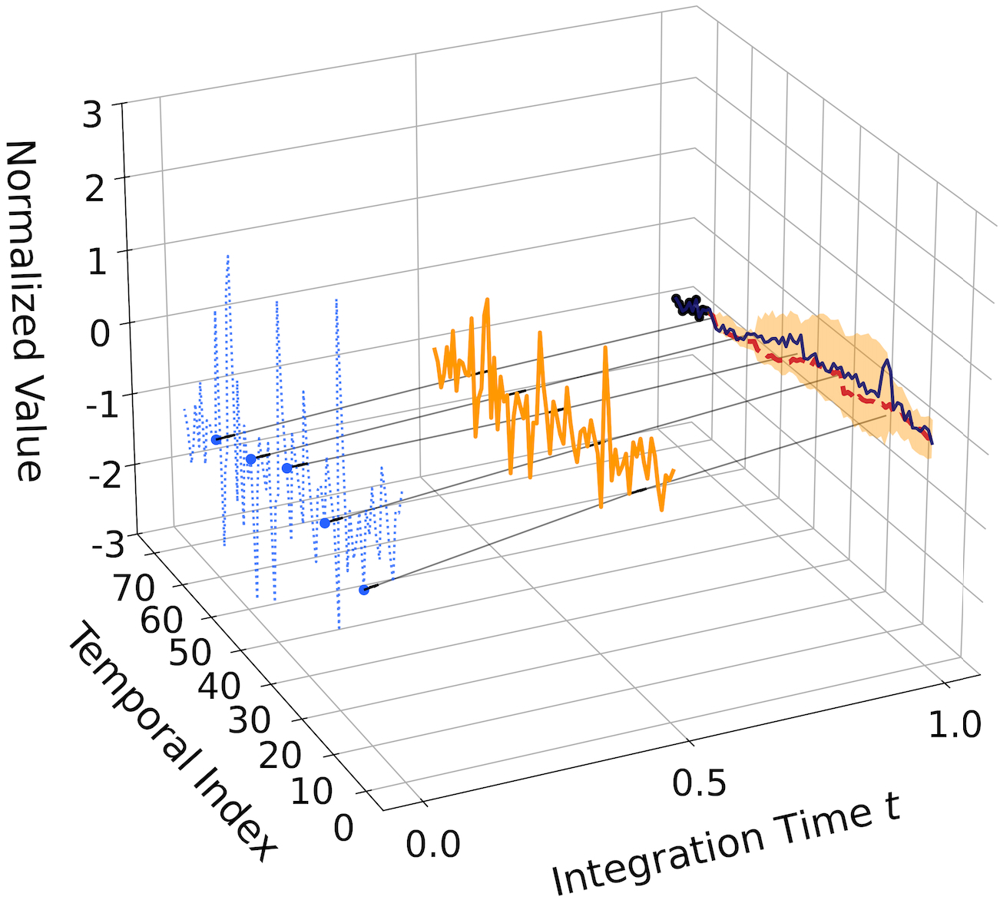
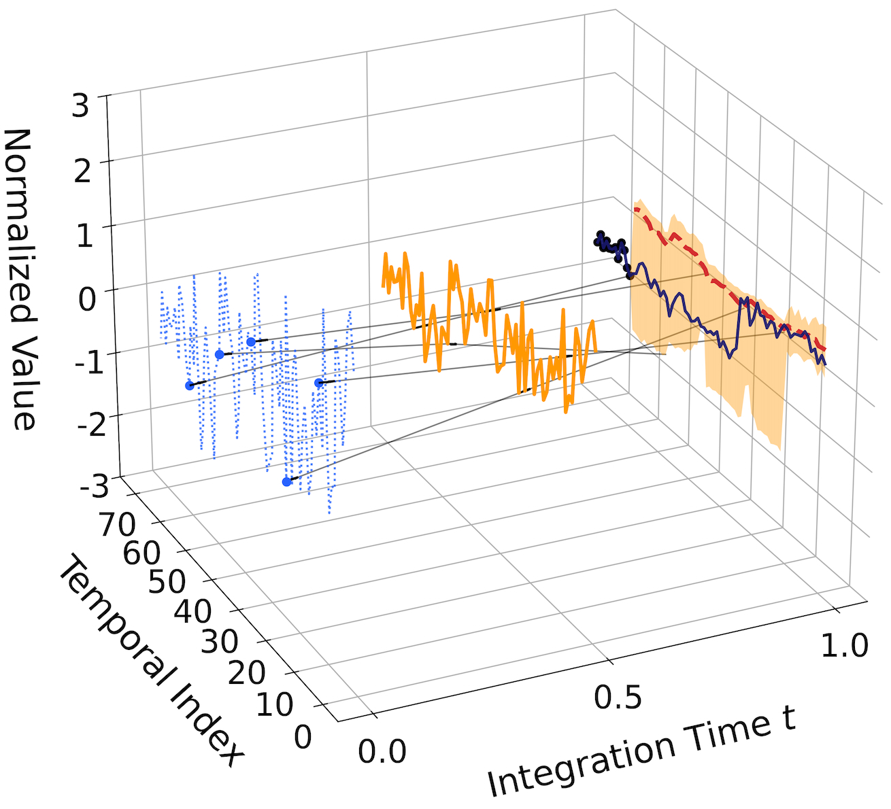

# LOFT: Low-Rank Prior-Induced Consistency Flow Matching for Efficient Traffic Imputation

This is the official implementation of **LOFT** (Low-Rank Prior-Induced Consistency Flow Matching). 

## Code Structure Description

Below is the description of the project's main files and directories, refactored to align with the Flow Matching framework:

```text
LOFT/
├── config/              # Contains configuration files (e.g., PEMS04.conf). Defines hyperparameters.
├── data/                # Data directory structure.
│   ├── miss_data/       # Stores ground truth and masked data.
│   └── pre_impute/      # Stores the Low-Rank Prior initialization and uncertainty maps.
├── low_rank_prior/      # Module for generating the Low-Rank Prior.
│   └── low_rank_prior.py    # Implements train and inference of Low-Rank Prior.
├── plt/                 # Visualization.
│   └── LOFT_plt_2steps_case.py  # Visualizes the generation trajectory and velocity fields.
├── params/              # Stores the trained model weights (.pth files).
├── results/             # Stores evaluation metrics and output tensors.
├── dataset_traffic.py   # Data loading and preprocessing.
├── models.py            # Core network architecture.
├── main_model.py        # Overall LOFT architecture.
├── run.py               # Main entry point for training and evaluation.
└── utils.py             # Utility functions.

```

## Requirements

We recommend using **Python 3.8+**. The core dependencies include:

* torch
* numpy
* pandas
* tqdm

You can install the dependencies via pip:

```bash
pip install torch numpy pandas tqdm
```

## Quick Start

The project consists of **Data Preparation** and **Model Training/Evaluation**.

### 1. Data Preparation

LOFT requires three specific types of data files for training and inference, as defined in `dataset_traffic.py`:

1. **True Data**: The original complete traffic data.
2. **Missing Data**: Data with specific missing masks.
3. **Prior & Sigma**: The initialized data and uncertainty map derived from the Low-Rank Prior estimation.

Downloaded data at: https://drive.google.com/drive/folders/1j_vF2gxiyAFN5OMIEfGSQINvnDkPNGOb?usp=sharing

Ensure your data directory structure matches the `config` file (e.g., `config/PEMS04.conf`):

```ini
[file]
data_prefix = ./data/miss_data/PEMS04
imputed_data_dir = ./data/pre_impute
```

### 2. Model Training

You can train the LOFT model using `run.py`. The hyperparameters (such as flow steps, layers, and learning rate) are defined in `config/*.conf` but can be overridden by command-line arguments.

**Example Command:**

Train on the PEMS04 dataset with the SC-TC missing pattern and 80% missing rate. 
**Note:** explicitly set `--num_steps` and `--alpha_warmup_ratio` to match the config file, otherwise `run.py` defaults (steps=3, ratio=1.0) will override them.

```bash
python run.py \
  --mode train \
  --dataset PEMS04 \
  --miss_type SC-TC \
  --miss_rate 0.8 \
  --device cuda:0 \
  --epochs 100 \
  --num_steps 20 \
  --alpha_warmup_ratio 0.8
```

**Key Training Arguments:**

* `--dataset`: Shortcut to load the corresponding config file (e.g., `PEMS04` loads `config/PEMS04.conf`).
* `--alpha_warmup_ratio`: Controls the curriculum learning for the rectification mechanism.
* `--num_steps`: The number of time discretization steps used during training.

### 3. Inference & Evaluation

Use `--mode eval` to evaluate a trained model. You must specify the path to the trained model weights using `--cond_path`. LOFT uses an **Euler ODE Solver** for inference, typically requiring very few steps (e.g., 2-5) to achieve high accuracy.

**Example Command:**

```bash
python run.py \
  --mode eval \
  --dataset PEMS04 \
  --cond_path params/PEMS04_SC-TC_0.8_20260212_235013_cond.pth \
  --device cuda:0
```

**Evaluation Metrics:**
The script will output metrics including RMSE, MAE, MAPE, and CRPS. Results are printed to the console and appended to a CSV file in the `./results/` directory.

### 4. Visualization of Generation Process

LOFT provides a visualization script to inspect the Velocity Field and the Rectified Generation Trajectories.

Getting the evaluation tensors (https://drive.google.com/drive/folders/1j_vF2gxiyAFN5OMIEfGSQINvnDkPNGOb?usp=sharing), then run the visualization script:

```
python plt/LOFT_plt_2steps_case.py
```

<p align="center">
  
  
</p>

